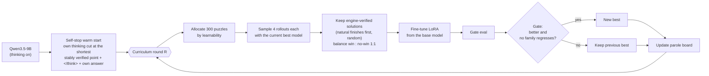

# Teaching a 9B LLM phutball: the expert-iteration curriculum

How Qwen3.5-9B (thinking mode, LoRA) is trained to solve phutball puzzles from its own engine-verified attempts,
why each piece exists, and how to run and read it. Code: `llm_train/`, `llm_bench/`; notebook:
`curriculum_colab.ipynb`. Drive: `MyDrive/phutball/curriculum/`.

## The idea in one paragraph

The model already *knows* a lot of phutball tactics but cannot *deliver* them: forced to answer after 6k tokens it
finds 92% of 1-jump wins, yet on its own it finishes 1% of the time, because it never stops thinking. Training
therefore has two jobs, teach it to stop, then teach it to search better, and it must do both without being told
how to think. Every training example is the model's own reasoning, and the phutball engine only decides which
answers are correct (and, for stopping, where the model could have stopped). Nothing scripted is ever imitated.

## Pipeline

## Every rule, and the failure that motivated it

| Rule | What went wrong without it |
| --- | --- |
| **Thinking on, fixed 6,144-token budget** for training and every eval | Comparisons across budgets were meaningless; a model that never stops at 6k also never stops at 12k or 24k (tested). |
| **Self-stop warm start** (`self_stop.py`, `sft_stop.py`) | GRPO from the base model got no signal: 100% of rollouts were cut off, even on 1-2-jump wins whose forced answers were 97% correct. A prompt telling it its budget changed nothing. |
| **Train only on engine-verified answers** (expert iteration, not reward-shaped RL) | GRPO with "cut off scores below wrong" taught the model to give up early and answer NO WIN: on wins, 30% → 92% "missed win" across stages. Expert iteration can never reinforce a wrong answer. |
| **Random choice among verified solutions, natural finishes first** (`--select random`) | Keeping the *shortest* verified solution taught a length prior: round 1 doubled finished accuracy but forced accuracy on 2-jump wins fell 74% → 42% (early NO WIN). |
| **Win : no-win examples balanced 1:1** | The first warm start had more no-win examples than wins (173 vs 146) and began RL already leaning to NO WIN (wins 5/16 vs no-wins 12/16 before any update). |
| **Fine-tune each round from the base model** (ReST-EM) | Not observed here; it follows ReST-EM, which retrains from the base each iteration to limit compounding drift. Each round's *data* comes from the current best model. |
| **Learnability allocation** `(1 - (1-p)^k)(1 - p)` per bucket | Hand-choosing the mix each round was slow and reactive. Expert iteration learns from puzzles with at least one success in k samples: compute goes where the model sometimes succeeds. (GRPO would use `p(1-p)`, the variance of the group reward.) |
| **Parole and release** | Puzzles the model never solves cost samples and teach nothing. A puzzle with no verified solution in 2 attempts is paroled; it returns when its bucket's solve rate rises 15 points, or when a 5% spot check solves it. Spot checks don't move bucket rates; rates need ≥ 16 samples. |
| **Promotion gate** (mean finished pass@1 must improve; no family's pooled forced accuracy may drop > 10 points) | Round 1 improved finished accuracy while losing search knowledge (forced 2-jump wins −23 points). The gate refuses such a model as the next generator, as AlphaGo Zero's gate does. |
| **Family-pooled drop checks** (wins / no-win / placements) | With 25 items per task the per-task noise is about ±10 points; a per-task 10-point check would fail at random. |
| **Board plus men list prompt** (`--prompt-format ascii+men`) | Models spent hundreds of thinking tokens reading men off the ASCII grid and mixing up columns. |
| **Sampled decoding in evals** (`--qwen-thinking-sampling`: T 0.6, top-p 0.95, top-k 20) | Greedy decoding makes thinking mode loop (Qwen warns against it); the first evals were greedy and understated every thinking model. |
| **Report finished and budget-forced separately** | "Unparsed" replies were all truncation: strict scores measured the token cap, not the model. Forced = what it knows by the budget; finished = what it delivers. The gate and the ≥66% target use finished. |
| **Benchmark positions excluded from all training pools; seeds disjoint** | Train/test contamination. |
| **One-rule baseline reported beside every table** (`--baseline adjacent`) | "Place next to the ball" solves 97.5% of prevent and 33.5% of the raw forced family; prevent is reported but excluded from the gate, and training forced puzzles drop adjacent answers. |

## Settings

| Setting | Value | Where |
| --- | --- | --- |
| Model | Qwen/Qwen3.5-9B, thinking on, LoRA r 32 (all linear layers of the language model) | `sft_stop.py` |
| Thinking budget | 6,144 tokens | notebook `CAP` |
| Puzzles per round | 300, 4 samples each, temperature 1.0 | `N`, `K` |
| Rounds | 30 to start (~1 h, ~7 Colab units each); raise any time | `ROUNDS` |
| Pool | `llm_train/puzzles/pool_v2.jsonl.gz`: 15,512 puzzles in 11 buckets (wins 1-4 jumps, forward and backward-trap; no-win; block; forced; prevent) | `POOL` |
| Fine-tune | 1 epoch, lr 5e-5, cosine, from the base model | `sft_stop.py` |
| Gate eval | 25 items per group, 1 sample, every round | `GATE_EK` |
| Full eval | 25 items per group, 4 samples (pass@1 and pass@4), round 1 and every 5th | `EK`, `FULL_EVERY` |
| Scheduler constants | `FLOOR 0.02`, `SPOT 0.05`, `PAROLE_AFTER 2`, `RELEASE_UPLIFT 0.15`, `MIN_SAMPLES 16`, `MAX_DROP 0.10` | `llm_train/curriculum.py` |

## Running it

Open `curriculum_colab.ipynb` from GitHub in Colab (A100, High-RAM) and Run all. Everything is written to Drive and
every step is skipped when its output exists, so after a disconnect Run all resumes where it stopped. Raising
`ROUNDS` continues from the next round with the same scheduler state. For an unattended run, uncomment the last cell
(`runtime.unassign()`) so billing stops when the rounds finish. The pool can grow while the curriculum runs: new
puzzle ids join as unattempted the next time the pool is loaded (ids must be unique; `make_pool.py` prefixes each
source).

## Reading the outputs

| File (under `curriculum/`) | What it tells you |
| --- | --- |
| `eval/untrained*`, `eval/warmstart*`, `eval/g0*` | Baselines with the men list; `g0` is the warm start under the gate protocol, the first "best". |
| `rR/ids.json` | The round's puzzles. The allocation per bucket is printed and stored in the state log. |
| `rR/stats.json` | Sample outcomes (finished correct / finished wrong / cut off / stable cut), puzzles solved per subtask, examples kept, `natural_share`. |
| `rR/outcomes.jsonl` | Per-puzzle counts: the scheduler's input. |
| `rR/gate.txt` | `PROMOTED` or `kept previous best`, with the reason. |
| `eval/gR*`, `eval/rR*` | Gate eval each round; full eval on round 1 and every 5th. |
| `state.json` | Every puzzle's status and attempts, bucket rates per round, the current best, and a log of allocations, parole and release counts, and gate decisions (printed by the Results cell). |

What healthy progress looks like: finished pass@1 rises toward the forced numbers; cut-off share falls; forced
accuracy holds or rises (if it falls, the model is trading search for stopping, and the gate should be refusing);
allocation moves toward the win depths the model sometimes solves; paroled puzzles come back as their buckets
improve. Repeated gate failures over several rounds mean expert iteration has plateaued: switch to GRPO from the
best model, with the reward that never prefers giving up and the scheduler's `p(1-p)` priority.

## Results so far (ASCII-only prompt, sampled, 6,144 tokens, finished pass@1)

| | untrained | warm start | round 1 (iid) |
| --- | --- | --- | --- |
| 1-jump wins | 1% | 37% | 60% |
| 2-jump wins | 0% | 18% | 31% |
| 3-jump wins | 0% | 16% | 27% |
| 4-jump wins | 0% | 2% | 8% |
| block | 0% | 7% | 29% |
| cut off (wins) | 99% | 71% | 30% |

Forced (what the model knows by 6k tokens), untrained: 1-4-jump wins 92 / 74 / 59 / 32%, block 53%, forced 49%,
prevent 5%. Round 1 raised block's forced accuracy to 75% but lowered 2-jump wins to 42%, the regression the gate now
catches. Round 2 of the hand-tuned runs is the last of that line; the curriculum restarts from the warm start with
the men list.

## Open questions

- Does approach-diverse sampling (Gurung, Whitammer & Lapata, *Strategically Diverse Sampling for Self-Training*)
  help in a search domain? The round-1 strategic arm kept search knowledge better (forced placements 53% vs 42%) but
  stopped less; the curriculum uses iid sampling for cost.
- How much of the difficulty is reading the board? Compare the `ascii` and `ascii+men` baselines.
- Do coordinate pairs `(r, c)` beat `a13` names (less column arithmetic vs. more tokens and swap errors)? Untested.
- Is the reasoning faithful? Claims inside the thinking ("jump h10 to h8 over h9") can be checked by the engine;
  a claim checker would measure whether correct answers rest on true statements.
- Does training install intuition or only tidier search? Evaluate with thinking capped at 256 tokens.

## v2 results and the per-puzzle v3 (2026-10-05)

v2 (this document's scheduler, rounds 1-9 from the self-stop warm start; full evals n = 100 per task): finished
accuracy on wins 38.2% (r1) -> 42.9% (r5) with truncation 54% -> 51%, while budget-forced accuracy stayed flat (84.5%
-> 83.0%): the model knows the answer ~83% of the time and finishes ~43%. Promoted: r1, r2, r6. Problems found:
- per-puzzle parole never fired (300 of 15,512 puzzles a round: a puzzle comes up once in ~50 rounds), so allocation
  ran on bucket averages;
- stable-cut credit made the no-win bucket read 0.92-0.96 and starved it to 3 puzzles a round, while finished accuracy
  on near-miss negatives was 40-67%; r8 (truncation 22%, best finished wins 57%) said NO WIN on more real wins;
- the 25-item gate is noise-dominated (r3 and r8 had the lowest truncation and were rejected);
- sft_stop trains a fresh LoRA from the base model on one round's ~400 examples, so nothing accumulated except
  through better generator data.

v3 (`llm_train/curriculum_pp.py`, `curriculum_pp_colab.ipynb`): per-puzzle success rates from 8 samples, finished
answers only; round 1 screens 1,600 puzzles; 8/8 mastered (no more sampling or new training), 0/8 paroled with 10%
spot checks as the only way back; a bank of each puzzle's latest verified examples, replayed 1:1 with each round's new
examples (at most 1,000) so the from-base retrain accumulates. Starts from v2's r6. The gate is unchanged (still the
weak point).

## v3 rounds 1-9 and v4: carrying the weights over (2026-10-06)

**Gate.** v3.0 rejected rounds 1-4 (validation wins finished 17% -> 37-41%) for saying NO WIN more and for losing forced
accuracy, both of which follow from learning to stop, and promoted r5, the worst model of the run (finished 0.191).
v3.1 promotes unless finished accuracy (wins, no-win, placements) is clearly worse (z < -1.5), with a forced-accuracy
collapse guard at z < -3; v3.2 also compares against the peak (the highest finished accuracy promoted so far), so
small accepted losses cannot add up. `regate` replayed every round: r1-r4 and r6 promoted, r5, r7, r8 rejected.

**Plateau.** Validation finished accuracy: v0 0.149, r1 0.320, r2 0.322, r3 0.313, r4 0.367, r5 0.191, r6 0.346,
r7 0.303, r8 0.317, r9 0.297 (r9 sampled from r6 and still lost). Almost all the gain came in round 1. Cause: every
round trained a fresh LoRA on the base model from ~544 examples (~272 new + equal replay), so no round built on the
previous one and even the warm start was not carried over. STaR and ReST-EM also retrain from base, but on a
re-sampled whole dataset; with 150 puzzles a round neither the data nor the weights accumulated.

**v4** (curriculum_v4_colab.ipynb): each round continues the best adapter (`sft_stop --init-adapter`; a rejected round
is discarded), replay 0.5x balanced over the subtasks (forgetting guard only), learning rate 1e-4. Round 1 reuses v3's
screen samples and continues the warm start, so v3 vs v4 differ only in whether the weights carry over. If v4 also
plateaus, the next test is LoRA (5e-5 / 2e-4) vs full-weight fine-tuning on the same data.

**v4 rounds 1-5** (validation finished accuracy): r1 0.383, r2 0.418 (promoted; best), r3 0.456, r4 0.467, r5 0.442 - r3-r5
rejected by the forced-accuracy collapse guard (wins: z -5.8, -8.3, -4.6; finished "NO WIN" on real wins 82 -> 169 -> 276).
Replay balanced over the subtasks had cut win-finding to ~53% of each training set, and with the weights carried over the
shift compounded. From round 6 replay is proportional to the bank (the notebook no longer passes --balance-replay).

**v4 rounds 6-14, and the NO WIN length floor.** With proportional replay r6 was promoted (0.474, z +2.8 over r2), but
every later round trained from the best slid back (r7 0.457, r8 0.471, r9 0.435, r10 0.405, r12 0.391, r13 0.389; r11
0.450 passed the gate's tolerance) - at lr 1e-4 and at 5e-5 alike: answers shortened to a 12-16 s median and 270-420
real wins were answered NO WIN. Cause, in the training sets: 40-55% of the NO WIN examples had < 1,000 thinking tokens
(median as low as 876 in r10) against a ~3,100 median for wins - the 2,048-token floor in expert_iter applied only to
cut-off answers, not to NO WIN answers the model finished by itself, and the bank replayed them. So each round taught
"no early win -> NO WIN". From round 14 the training set drops NO WIN examples under 2,048 thinking tokens (new and
replayed; curriculum_pp update --min-nowin-think), and the best is reset to r6.

**Rounds 14-16 with the floor: the swing the other way.** r14 promoted (0.459; NO WIN on real wins 167 -> 136). r15 reached
finished accuracy 0.545 (z +4.7 over r14, +3.8 over the peak r6; only 38 real wins answered NO WIN) but was rejected:
forced accuracy on near-miss negatives 93% -> 67% (z -3.9) - cut off on a no-win position it now guessed a win - and r16
claimed 80 "wins" that do not reach the goal. With the floor alone NO WIN fell to ~3% of each training set (11-13
examples, r6 had ~10%). From round 17 long NO WIN examples (>= 2,048 thinking tokens) are topped up to 10% of the
training set from the bank (--nowin-share).
